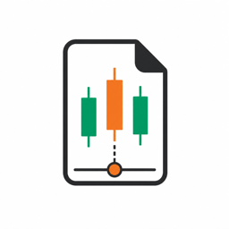
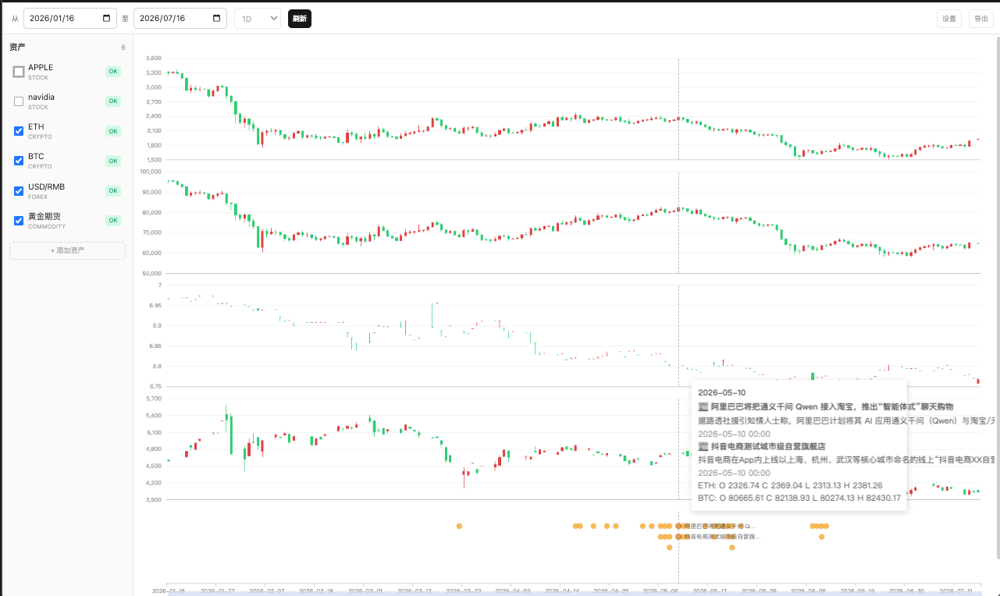

<p align="center">
  
</p>

<h1 align="center">Notion News × Market K-Line</h1>

把 Notion 里的新闻和事件，放到多类资产的 1D K 线上，用同一条日期轴对照查看。

这是一个本地运行的只读看板：事件来自 Notion，行情优先来自 Finnhub，并在可用时回退到 Yahoo Finance。它适合复盘“事件发生前后，市场发生了什么”，不提供预测、交易信号或投资建议。

## 界面预览



## 功能

- 同屏查看股票、加密货币、主要汇率、黄金/原油期货和美国利率
- 按北京时间对齐所有 K 线和 Notion 事件
- 自定义查询日期，默认显示最近 6 个月
- 勾选资产，控制图表显隐
- 联动十字线、缩放和拖动多个图表
- 悬停查看 OHLC 与事件摘要；点击带 URL 的事件打开原文
- Finnhub 无数据或不支持某个品种时，自动尝试 Yahoo Finance

## 快速开始

需要 Node.js 18+、一个可访问目标数据库的 Notion integration，以及 Finnhub API key。

```bash
git clone https://github.com/tinymindkin/notion-news-k.git
cd notion-news-k
npm install
cp .env.example .env
```

填写 `.env` 后，构建并启动：

```bash
npm run build
npm run preview
```

打开 <http://127.0.0.1:8787>。

### 开发模式

开发时需要同时运行后端和 Vite。分别打开两个终端：

```bash
# 终端 1：API 后端
npm run api
```

```bash
# 终端 2：前端开发服务器
npm run dev
```

打开 <http://127.0.0.1:5173>。Vite 会把 `/api` 代理到 `127.0.0.1:8787`。

## 配置指南

### 1. 创建 Notion integration

这个项目只读取你自己的 workspace，创建一个 Internal connection 即可：

1. 打开 [Notion Developer Portal](https://www.notion.so/developers)。
2. 进入 `Build` → `Internal connections`，点击 `Create a new connection`。
3. 填写名称并选择新闻数据库所在的 workspace。创建 connection 需要 Workspace Owner 权限。
4. 在 connection 的 `Configuration` 页面确认已启用 `Read content`，复制 `Installation access token`。
5. 把 token 填入 `.env` 的 `NOTION_KEY`。

这个 token 通常以 `ntn_` 开头，只会交给本地 Node 后端。不要把它发给别人、写入源码或提交到 Git；如果曾经泄露，请在 Configuration 页面刷新 token。Notion 的完整流程可参考[官方 Internal connections 指南](https://developers.notion.com/guides/get-started/internal-connections)。

### 2. 设置新闻 database 字段

在 Notion 中新建一个 Table database，推荐使用下面这套最小字段：

| 属性名 | 类型 | 必填 | 说明 |
| --- | --- | --- | --- |
| `Name` | Title / 标题 | 否 | 事件标题，缺失时显示“无标题” |
| `事件时间` | Date / 日期 | 是 | 用于筛选、排序和对齐 K 线 |
| `brief` | Rich text / 文本 | 否 | 悬停时显示的事件摘要 |
| `URL` | URL | 否 | 点击事件后打开的来源 |
| `Created time` | Created time / 创建时间 | 否 | 随接口返回，不参与时间轴定位 |

请按表格设置字段名称和类型；其中 `事件时间` 必须完全一致且类型必须是 Date。标题也兼容 `name` 或 `标题`，摘要也兼容 `Brief` 或 `摘要`，链接也兼容 `url`。缺少或无法解析 `事件时间` 的记录会被跳过；日期区间目前只使用开始时间。

### 3. 授权 database

新建的 integration 默认不能读取任何页面。打开新闻 database，点击右上角 `•••` → `Connections` → `Add connection`，选择刚才创建的 connection 并确认授权。也可以在 Developer Portal 的 `Content access` → `Edit access` 中选择该 database。

没有完成这一步时，`/api/events` 通常会返回 `object_not_found`。如果使用 linked database，需要授权原始 database，而不是只授权链接视图。

### 4. 获取 database ID 和 data source ID

- `NOTION_DATABASE_ID`：打开 database，复制页面链接。链接中 `?` 之前末尾的 32 位字符就是 database ID，带不带连字符都可以。
- `NOTION_DATA_SOURCE_ID`：打开 database 的设置菜单，进入 `Manage data sources`，点击目标 data source 的 `•••` → `Copy data source ID`。

一个 database 现在可以包含多个 data source，两个 ID 不能混用。本项目使用 data source ID 查询新闻，database ID 用于在配置失效时重新找到第一个 data source。可参考 Notion 的[官方 ID 说明](https://developers.notion.com/reference/retrieve-a-data-source)。

### 5. 填写环境变量

复制示例配置：

```bash
cp .env.example .env
```

然后填写 `.env`：

```dotenv
NOTION_KEY=<Notion installation access token>
NOTION_DATABASE_ID=<新闻 database ID>
NOTION_DATA_SOURCE_ID=<新闻 data source ID>
FINNHUB_API_KEY=<Finnhub API key>
PORT=8787
```

| 环境变量 | 必填 | 用途 |
| --- | --- | --- |
| `NOTION_KEY` | 是 | Notion installation access token |
| `NOTION_DATABASE_ID` | 是 | database 容器 ID；data source ID 无效时用于重新解析 |
| `NOTION_DATA_SOURCE_ID` | 是 | 实际查询的新闻 data source ID |
| `FINNHUB_API_KEY` | 是 | 从 [Finnhub Dashboard](https://finnhub.io/dashboard) 获取的 API key |
| `PORT` | 否 | 后端端口，默认 `8787` |

不要给这些变量添加 `VITE_` 前缀，也不要提交 `.env`。开发模式若修改 `PORT`，还需要同步修改 `vite.config.ts` 中的代理端口。

## 内置资产

| ID | 标的 | 类型 |
| --- | --- | --- |
| `AAPL` | APPLE | 股票 |
| `NVDA` | NVIDIA | 股票 |
| `ETH` | ETH | 加密货币 |
| `BTC` | BTC | 加密货币 |
| `USDCNY` | USD/RMB | 外汇 |
| `GOLD` | 黄金期货 | 商品 |
| `OIL` | WTI 原油期货 | 商品 |
| `USDJPY` | USD/JPY（日元） | 外汇 |
| `EURUSD` | EUR/USD（欧元） | 外汇 |
| `UST10Y` | 美国10年国债收益率 | 利率 |
| `FEDFUNDS` | 联邦基金有效利率 | 利率 |

资产配置位于 `shared/assets.mjs`。当前界面不能直接添加资产；如需扩展，请在该文件中配置 Finnhub symbol、endpoint 和 Yahoo symbol。

## API

| 请求 | 说明 |
| --- | --- |
| `GET /api/health` | 返回后端健康状态 |
| `GET /api/events?from=YYYY-MM-DD&to=YYYY-MM-DD` | 查询指定日期范围内的 Notion 事件 |
| `GET /api/candles?asset=AAPL&from=YYYY-MM-DD&to=YYYY-MM-DD` | 查询内置资产的日 K 线 |

`/api/candles` 必须提供 `asset`、`from` 和 `to`；日期格式为 `YYYY-MM-DD`。接口只读，响应不缓存。

## 工作方式

```text
React / ECharts
      │  /api
      ▼
Node HTTP server
      ├── Notion API：新闻与事件
      ├── Finnhub API：日 K 线 → Yahoo Finance fallback
      └── FRED：美国国债与联邦基金日频利率
```

```text
server/   Node 后端、Notion 与行情适配
shared/   前后端共享的资产配置
src/      React 页面、组件、API client 与图表配置
```

技术栈：React 18、TypeScript、Vite 5、ECharts 5、Tailwind CSS、Node.js。

## 常见问题

### `ECONNREFUSED 127.0.0.1:8787`

Vite 已启动，但 API 后端没有监听 `8787`。运行 `npm run api`，并检查终端是否因缺少 `.env` 变量而退出。

### Notion 返回 `object_not_found`

确认 database ID 和 data source ID 正确，并把目标数据库共享给 `NOTION_KEY` 对应的 integration。

### 某个资产显示“无”

Finnhub 可能没有返回该品种的数据、免费账号没有对应权限，或请求被限流。程序会尝试 Yahoo Finance；两个数据源都失败时，该资产显示无数据，其余资产仍可使用。

## 当前边界

- 只读，不会修改 Notion 内容，也不保存行情数据
- 仅支持日线和代码内配置的资产
- Notion 事件按单个时间点展示，不支持区间事件或分类筛选
- 设置、导出、界面内添加资产和暗色模式尚未开放
- 第三方行情接口的权限、限流和可用性会影响结果

## 验证

```bash
npm run build
npm run check:secrets
curl http://127.0.0.1:8787/api/health
```

`check:secrets` 用于确认构建产物中没有常见的 Notion 或 Finnhub 密钥标记。

> 本项目仅用于信息整理和事件复盘，不构成投资建议。
